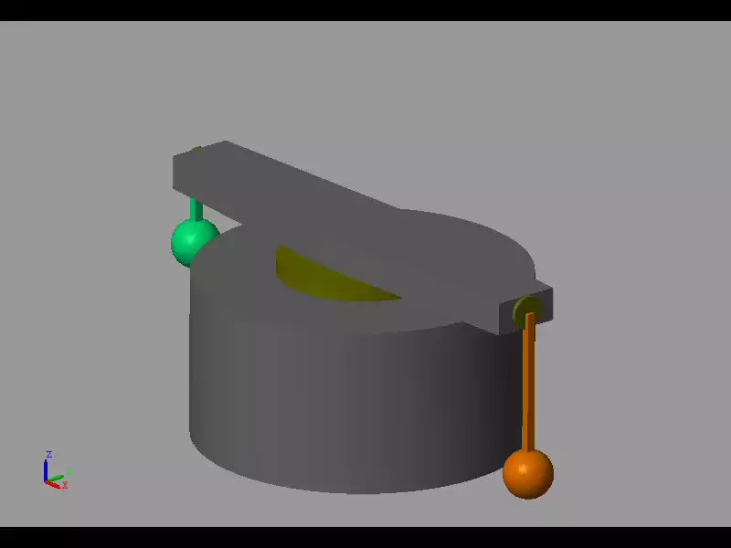
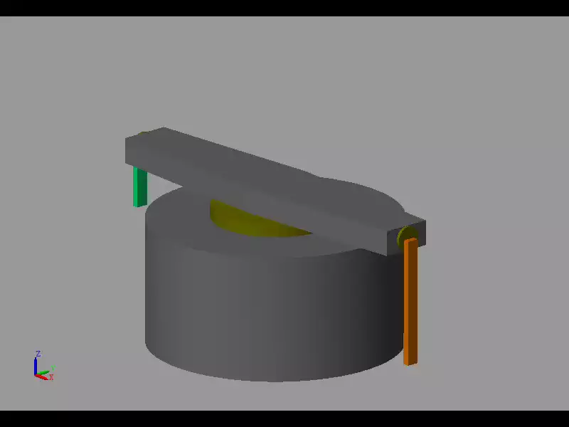

# 回転型2重振子の振り上げ安定化シミュレーション

## 概要
回転型2重振子の振り上げ制御安定化を行うMATLABシミュレーションコードです。質点モデルと剛体モデルの2種類の実装があり、非線形最適制御に基づいて振り上げ軌道の設計と安定化制御を行います。

## 機能
- 2重振子の振り上げ軌道の最適化計算
- 時変ゲインの設計による安定化制御
- 質点モデル/剛体モデルの切り替え
- シミュレーション結果の可視化

## ファイル構成
- `main.m`: メインスクリプト
- `+pm/`: 質点モデル (Point Mass) 関連のクラス群
- `+rb/`: 剛体モデル (Rigid Body) 関連のクラス群
- `Solver.m`: 最適制御問題のソルバー
- `Regulator.m`: レギュレータの設計
- `Regulator_test.m`: レギュレータの動作確認用スクリプト
- `plot_results.m`: 結果の可視化

## 使用方法
1. MATLABで`main.m`を開く
2. モデルの選択（`model = "pm"` または `"rb"`）
3. スクリプトを実行

### Simscape Multibodyによるアニメーション描画 質点モデル(pm)の場合
1. +pm/DoublePendulumPM_ParamSet.m を実行
2. +pm/DoublePendulumPM.slx を実行

### Simscape Multibodyによるアニメーション描画 剛体モデル(rb)の場合
1. +rb/DoublePendulumRB_ParamSet.m を実行
2. +rb/DoublePendulumRB.slx を実行

## 動作確認環境
MATLAB R2023b

### Toolbox等
制御系設計、結果の描画のみの場合はToolbox不要。
アニメーション描画には、Simulink、Simscape Multibodyが必要。
